# SKN33-1ST-3TEAM

## 🔎 프로젝트명
### 자동차 리콜 통합 조회 시스템

## 팀 소개
### 팀명: 3조
<table>
<tr>
    <th>신진호</th>
    <th>김정재</th>
    <th>이준희</th>
    <th>유하연</th>
</tr>

<tr>
    <td align="center">
        
    </td>
    <td align="center">
        
    </td>
    <td align="center">
        
    </td>
    <td align="center">
        
    </td>
</tr>

<tr>
    <td align="center">
        <a href="https://github.com/Gitcatho">GitHub</a>
    </td>
    <td align="center">
        <a href="https://github.com/kimjeongjaeae">GitHub</a>
    </td>
    <td align="center">
        <a href="https://github.com/Isnthee">GitHub</a>
    </td>
    <td align="center">
        <a href="https://github.com/lululu9988">GitHub</a>
    </td>
</tr>

</table>

- 신진호: 팀장, git 관리, 웹 크롤링, DB 설계
- 김정재: DB 설계, Streamlit, 데이터 가공, 시각화
- 이준희: 웹 크롤링, git관리
- 유하연: DB 설계, Streamlit

## 프로젝트 소개

1. 차량별 리콜 이력 조회
2. 리콜 통계 및 시각화 분석
3. 지역/제조사별 서비스센터 검색
4. 리콜 관련 뉴스 검색
5. 리콜 FAQ 조회

### 💻 기술스택

    
    
    
    
    
    
    

## 프로젝트 필요성(배경)

최근 자동차 리콜은 단순한 부품 결함을 넘어 소프트웨어 오류, 전기·전자장치 문제 등으로 발생 범위가 확대되고 있다. 실제로 국내에서는 기아 레이, 현대 싼타페 등 수십만 대 규모의 리콜이 발생했으며, 글로벌 시장에서도 혼다를 비롯한 주요 제조사들이 대규모 리콜을 진행하고 있다.

그러나 리콜 정보는 제조사, 정부기관, 뉴스 기사 등 다양한 곳에 분산되어 있어 사용자가 자신의 차량에 대한 리콜 여부와 관련 정보를 한 번에 확인하기 어렵다는 문제가 있다.

본 프로젝트는 공공데이터와 웹 크롤링을 활용하여 자동차 리콜 정보를 통합 제공하고, 차량별 리콜 조회, 서비스센터 검색, FAQ, 관련 뉴스 및 데이터 분석 기능을 제공함으로써 사용자가 쉽고 빠르게 리콜 정보를 확인할 수 있도록 지원하고자 한다.

### 관련기사

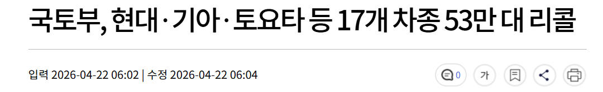

http://imnews.imbc.com/news/2026/econo/article/6817038_36932.html 

https://car.withnews.kr/newcar/us-auto-recall-trade-pressure

## 프로젝트 목표
자동차 리콜 정보가 여러 공공데이터, 뉴스, 서비스센터 정보로 흩어져 있어 사용자가 한번에 확인하기 어렵다는 문제를 해결하는게 주 목표입니다.
이 프로젝트를 통해 차량 리콜 데이터를 수집, 정제하여 DB화 하고 웹 서비스로 제공하여 사용자가 자신의 차량 리콜 여부와 관련 정보를 쉽고 빠르게 확인할 수 있도록 합니다.

## 데이터 수집 방법

- 공공데이터 포털에서 리콜 자동차 정보 csv파일로 수집
- 웹페이지 크롤링으로 FAQ 데이터 수집
- Naver News API 이용해 차량별 리콜 뉴스데이터 수집

## DB 설계(논리/물리 ERD)
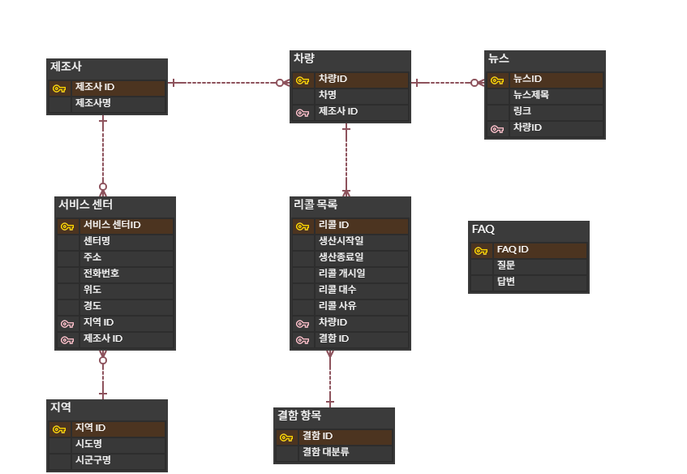
논리 ERD 설계
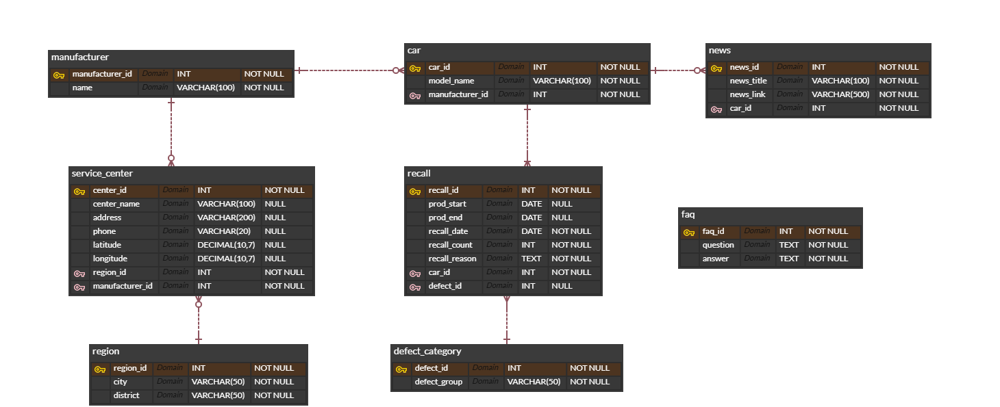
물리 ERD 설계

## 주요기능

### 1. 메인 대시보드
- 각 서비스로 바로 이동
### 2. 내 차 리콜 조회
- 제조사, 차종 선택시 리콜 대상, 이력 조회
- 선택 차종 관련 리콜 뉴스 조회
### 3. 리콜 데이터 분석
- 연도 범위내 데이터 분석
- 제조사별 리콜 건수
- 연도별 리콜 추이
- 결함 유형별 리콜 건수
- 연도별 결함 유형 추이
- 브랜드별 결함 유형 현황
- 제조사별 차종 리콜 현황
### 4. 가까운 서비스센터 찾기
- 지역별 서비스센터 찾기
- 제조사별 필터링 가능
### 6. 리콜 뉴스 검색
- 리콜 관련 키워드 검색
- 차종별 리콜 관련 뉴스 검색
### 7. 자동차 리콜 FAQ
- FAQ 검색 기능 지원
- 키워드 강조 기능 제공
## 실행방법

<a href=SET_README.md>SET_README.md</a>
SET_README.md 참고

## 수행 화면 캡처
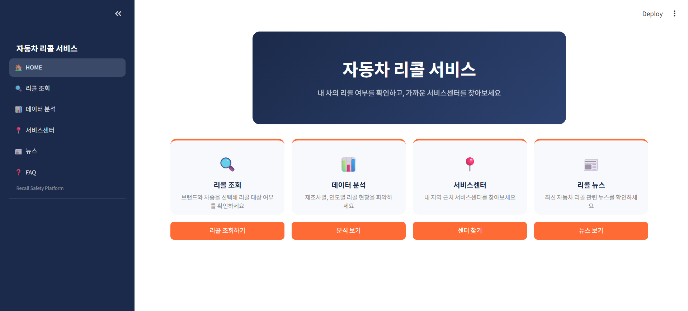

좌측 사이드 바, 중앙 버튼을 클릭해 각 페이지로 이동가능

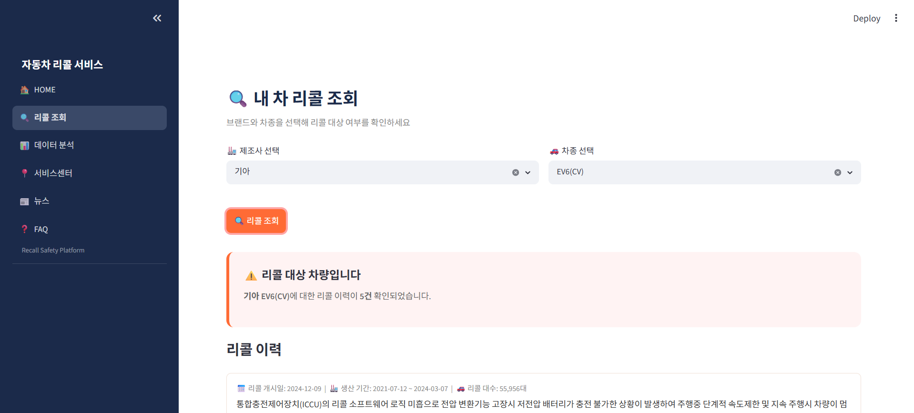
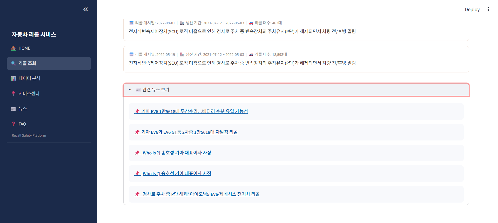

리콜 조회 페이지: 내 차가 리콜 대상인지 확인가능 리콜 사유랑 과거 리콜 이력 조회도 가능, 
하단에 해당리콜 정보와 관련된 뉴스 확인가능

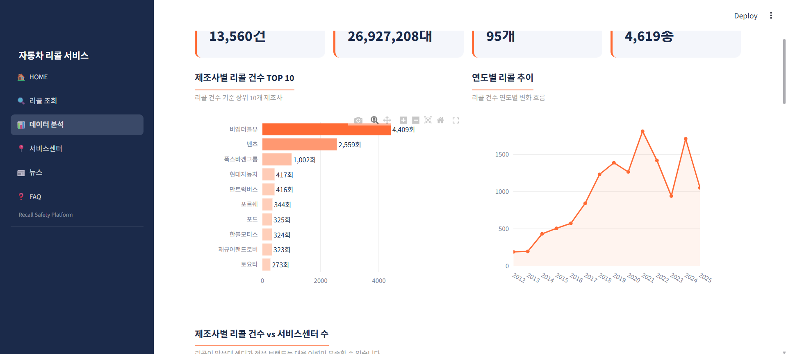
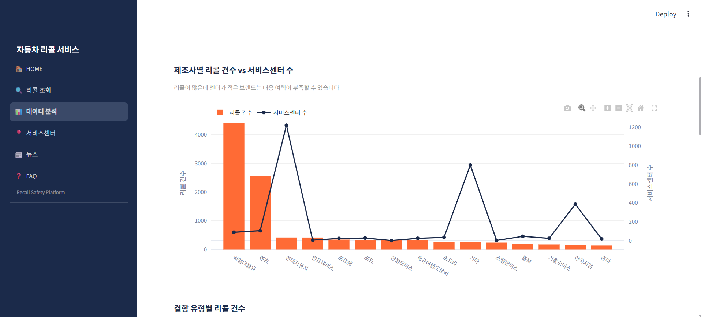
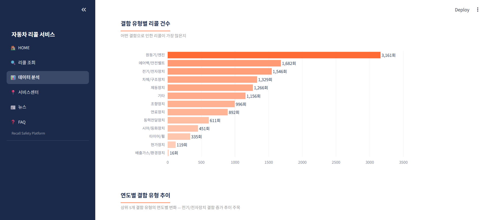
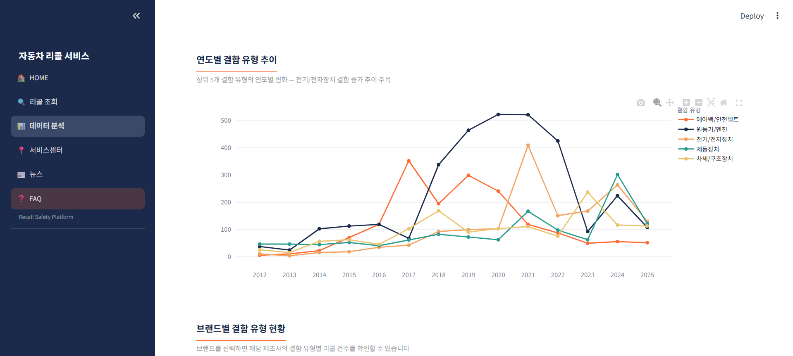
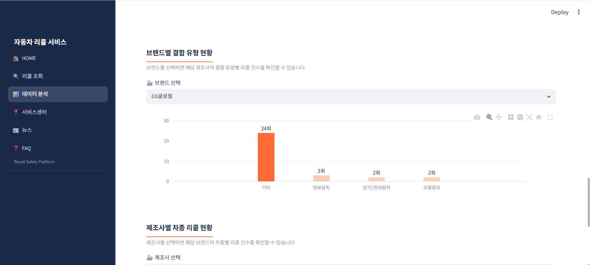
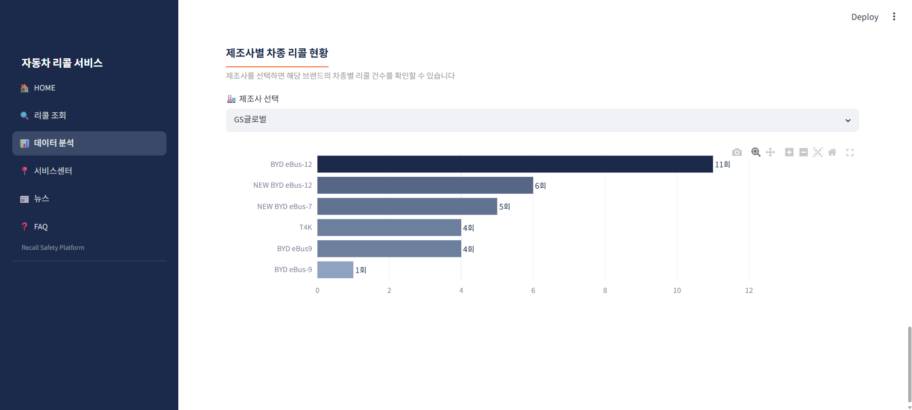
데이터 분석 페이지: 리콜정보를 활용해 다양한 데이터 대시보드 제공

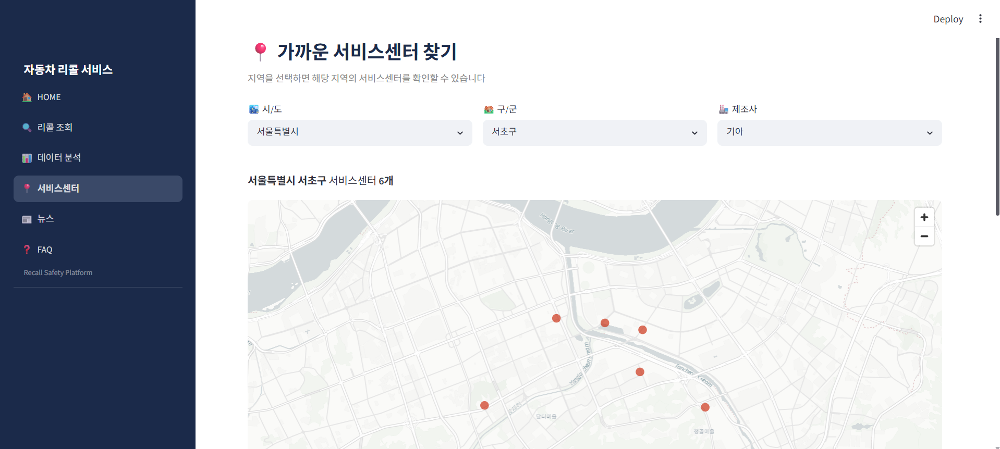
서비스 센터 페이지: 가까운 서비스 센터를 찾을수 있는 페이지

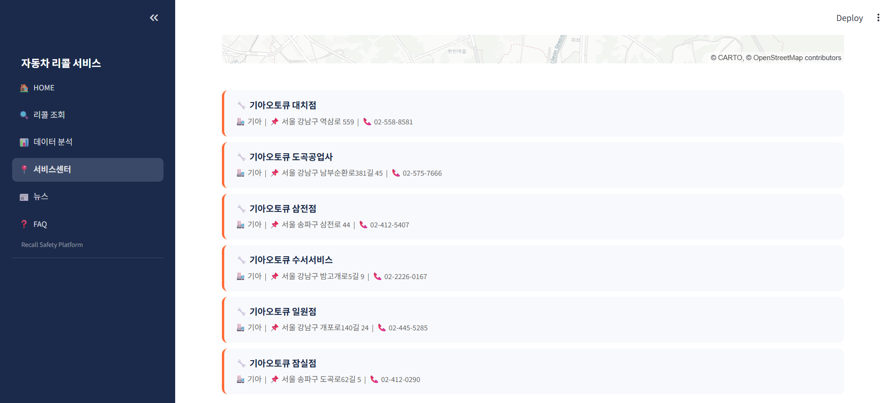
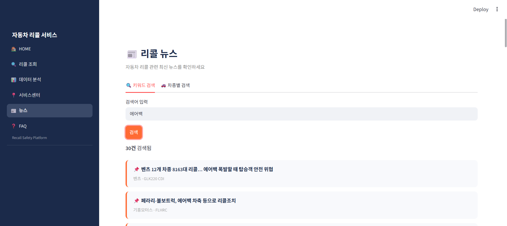
뉴스 페이지: 원하는 키워드 혹은 제조사, 차종별 뉴스 검색

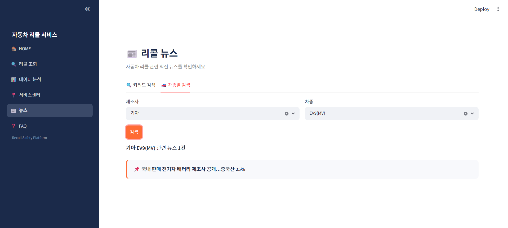
FAQ 페이지: 자동차 리콜 관련 자주 묻는 질문 확인, 원하는 키워드로 검색

## 📝회고 

| 이름 | 회고                                                                                                                                                                                                                    |
|--------|-----------------------------------------------------------------------------------------------------------------------------------------------------------------------------------------------------------------------|
| 신진호 | 교육장에서 진행한 첫 프로젝트였습니다. 큰 문제 없이 마무리할 수 있어 만족스러웠고, 각자 배우고 싶었던 분야를 맡아 진행하며 모두가 성장할 수 있는 프로젝트였던 것 같습니다.                                                                                                                    |
| 김정재 | 첫 프로젝트였기 때문에 이런저런 어려움이 있었지만 잘 마무리할 수 있었습니다. 프로젝트 기획, 일정 조율이 중요하고 어렵다는 것을 다시 한번 느꼈습니다. 데이터베이스 전반을 담당하며 신뢰할 수 있는 데이터와 잘 관리될 수 있는 데이터의 중요성을 느꼈습니다. 추가적으로 다음 프로젝트에서는 Git을 주도적으로 활용할 수 있도록 공부를 해야겠다고 다짐했습니다.               |
| 이준희 | 유능한 팀원분들과 클로드 덕분에 1st 프로젝트를 무사히 완료할 수 있었던 것 같습니다. 팀원 분들의 발목을 잡지 않기 위해 아둥바둥 한 것 치곤 1인분도 해내지 못한 것 같은 아쉬움이 남아 자신을 반성하게 되었습니다. git과 github를 통한 첫 협업 경험은 재직 중에도 경험하지 못한 값진 경험인 동시에, 앞으로 다가올 수 많은 충돌에 대한 경각심 또한 심어준 것 같습니다. |
| 유하연 | github 작업에서 문제가 생기지 않도록, git사용법에 대해 더 숙지하는 것이 좋겠다고 생각했습니다.                                                                                                                                                            |
